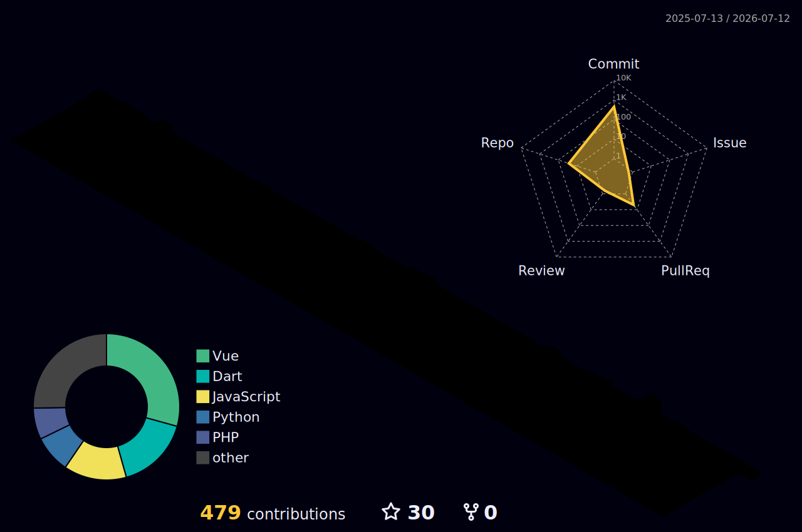

<!-- ═══════════════════════════════════════════════════════════════════════════════ -->
<!-- 🌊 ANIMATED HEADER -->
<!-- ═══════════════════════════════════════════════════════════════════════════════ -->

<!-- ═══════════════════════════════════════════════════════════════════════════════ -->
<!-- ✨ ANIMATED TYPING -->
<!-- ═══════════════════════════════════════════════════════════════════════════════ -->

  

<!-- ═══════════════════════════════════════════════════════════════════════════════ -->
<!-- 📊 PROFILE BADGES -->
<!-- ═══════════════════════════════════════════════════════════════════════════════ -->

  
  
  
  

 

<!-- ═══════════════════════════════════════════════════════════════════════════════ -->
<!-- 🙋‍♂️ ABOUT ME -->
<!-- ═══════════════════════════════════════════════════════════════════════════════ -->

##  &nbsp;About Me

> *"Learning never exhausts the mind — it only ignites it."*

 

- 🔭 I'm currently exploring **Full Stack Development, Data Analytics, Data Science, AI & ML**
- 🌱 I'm deepening my knowledge in **Machine Learning & Deep Learning**
- 💻 I love building things with **Laravel, React, Next.js & Python**
- 📊 I'm passionate about **turning data into actionable insights**
- 🎯 2026 Goals: **Contribute to Open Source & master AI/ML**
- ⚡ Fun fact: **I code, I learn, I repeat ♾️**
- 📫 Reach me at: **misbahulmunir36843@gmail.com**

 
 

<!-- ═══════════════════════════════════════════════════════════════════════════════ -->
<!-- 🛠️ TECH STACK -->
<!-- ═══════════════════════════════════════════════════════════════════════════════ -->

## 🛠️ Tech Stack & Tools

<b>🔤 Languages</b>

 

  

<b>🧰 Frameworks & Libraries</b>

 

  

<b>🗄️ Databases & Cloud</b>

 

  

<b>🤖 Data Science & AI</b>

 

  

  
  
  
  
  

<b>🔧 Tools & Platforms</b>

 

  

 

<!-- ═══════════════════════════════════════════════════════════════════════════════ -->
<!-- 📈 GITHUB STATS -->
<!-- ═══════════════════════════════════════════════════════════════════════════════ -->

## 📈 GitHub Statistics

  
  

<!-- ═══════════════════════════════════════════════════════════════════════════════ -->
<!-- 📊 3D CONTRIBUTION GRAPH -->
<!-- ═══════════════════════════════════════════════════════════════════════════════ -->
<!-- 3D Isometric view - generated by GitHub Action (3d-contrib.yml) -->
<picture>
    <source media="(prefers-color-scheme: dark)" srcset="./profile-3d-contrib/profile-night-rainbow.svg"/>
    <source media="(prefers-color-scheme: light)" srcset="./profile-3d-contrib/profile-south-season-animate.svg"/>
    
  </picture>

<!-- 📊 Flat Activity Graph (complementary, different perspective) -->

<b>📊 Flat Activity Graph (Click to expand)</b>

 

  

 

<!-- ═══════════════════════════════════════════════════════════════════════════════ -->
<!-- 🏆 TROPHIES -->
<!-- ═══════════════════════════════════════════════════════════════════════════════ -->

## 🏆 Achievements & Milestones

<!-- 
  ℹ️ Uncomment the section below when github-profile-trophy service is back online:
  

    
  

-->

  
  

  
  
  

 

<!-- ═══════════════════════════════════════════════════════════════════════════════ -->
<!-- 🐍 SNAKE ANIMATION -->
<!-- ═══════════════════════════════════════════════════════════════════════════════ -->

## 🐍 Contribution Snake

<picture>
  <source media="(prefers-color-scheme: dark)" srcset="https://raw.githubusercontent.com/MISBAHULLL/MISBAHULLL/output/github-snake-dark.svg"/>
  <source media="(prefers-color-scheme: light)" srcset="https://raw.githubusercontent.com/MISBAHULLL/MISBAHULLL/output/github-snake.svg"/>
  
</picture>

  

<!-- ═══════════════════════════════════════════════════════════════════════════════ -->
<!-- 💡 RANDOM DEV QUOTE -->
<!-- ═══════════════════════════════════════════════════════════════════════════════ -->

## 💡 Random Dev Quote

  

 

<!-- ═══════════════════════════════════════════════════════════════════════════════ -->
<!-- 🌐 CONNECT WITH ME -->
<!-- ═══════════════════════════════════════════════════════════════════════════════ -->

## 🌐 Let's Connect!

  
  
  
  

 

<!-- ═══════════════════════════════════════════════════════════════════════════════ -->
<!-- 📌 PINNED SECTION -->
<!-- ═══════════════════════════════════════════════════════════════════════════════ -->

## 📌 Featured Projects

  

<!-- You can add specific repos here using github-readme-stats pin cards: -->
<!-- 

  

-->

 

<!-- ═══════════════════════════════════════════════════════════════════════════════ -->
<!-- ☕ SUPPORT -->
<!-- ═══════════════════════════════════════════════════════════════════════════════ -->

  
    
  

<!-- ═══════════════════════════════════════════════════════════════════════════════ -->
<!-- 🌊 ANIMATED FOOTER -->
<!-- ═══════════════════════════════════════════════════════════════════════════════ -->

